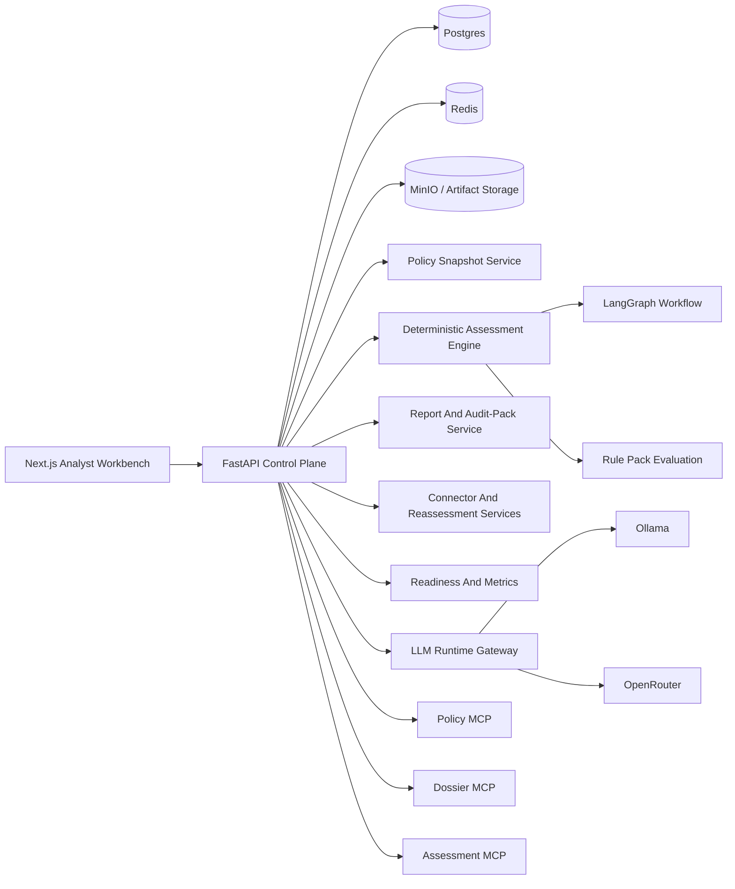
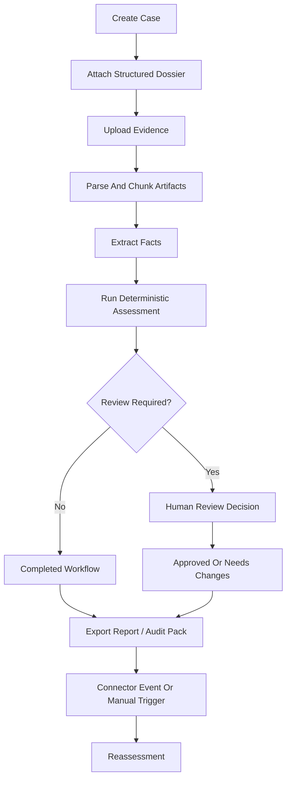

# EU-Comply


Production-grade AI governance and EU AI Act assessment platform with a deterministic policy engine, governed review workflows, first-party MCP servers, audit-pack exports, and dual runtime compatibility for `OpenRouter` and `Ollama`.

## Table Of Contents

- [Short Abstract](#short-abstract)
- [Current Validated Snapshot](#current-validated-snapshot)
- [Deep Introduction](#deep-introduction)
- [The Entire System Explained](#the-entire-system-explained)
- [Current Product Scope](#current-product-scope)
- [Repository Layout](#repository-layout)
- [Detailed Local Setup](#detailed-local-setup)
- [Detailed Deployment Guide](#detailed-deployment-guide)
- [Verification And Quality](#verification-and-quality)
- [Development Notes](#development-notes)
- [References](#references)

## Short Abstract

EU-Comply is designed for the real workflow behind EU AI Act readiness.

Instead of asking an LLM to read the law and guess a tier, the platform stores a
real case dossier, ingests evidence, extracts structured facts, evaluates those
facts through deterministic rule packs, routes sensitive outcomes through human
review, and exports audit-ready bundles that preserve the evidence, assessment,
workflow state, and policy context used at the time of the decision.

This repository is built as a product, not a throwaway demo:

- a FastAPI control plane exposes the case, assessment, reporting, runtime, and integration APIs
- a Next.js analyst workbench operates live cases against the backend
- LangGraph orchestrates governed assessment workflows and review gates
- first-party MCP servers expose policy, dossier, and assessment surfaces over streamable HTTP
- Docker packaging, compose deployment, benchmark tooling, migrations, and release docs are included

The current implementation is already end-to-end across the major product
surfaces. The important honesty note is that the deterministic legal content is
still at a baseline coverage layer rather than a full article-by-article AI Act
codification. The platform architecture is production-grade; the legal rule
library is intentionally structured to expand.

## Current Validated Snapshot

| Signal | Value |
|---|---:|
| API test suite | `36 passing tests` |
| Benchmark scenarios | `5` |
| Deterministic rules in baseline pack | `3` |
| Policy sources seeded | `3` |
| Policy snapshots seeded | `1` |
| Normalized legal fragments seeded | `5` |
| Mounted MCP servers | `3` |
| Runtime providers | `2` (`OpenRouter`, `Ollama`) |
| Compose services | `5` (`postgres`, `redis`, `minio`, `api`, `web`) |
| Alembic migrations | `9` |
| Docker image builds | `verified` |

## Deep Introduction

### What problem this project solves

If an organization wants to ship or continue operating an AI system in Europe,
the hard part is usually not reading a summary of the AI Act. The hard part is
turning a messy real-world AI system into something a governance team can assess
and defend.

That usually means answering all of these questions together:

- what exactly is the system
- who is acting as provider, deployer, importer, or distributor
- what evidence do we have and where did it come from
- which obligations are implicated
- where are the conflicts or missing facts
- who reviewed the result
- how do we prove what was decided later

Most "AI Act classifier" projects stop too early. They do retrieval over legal
text, produce a neat-looking answer, and call it done. That is useful as a
prototype, but it is not how enterprise compliance programs actually operate.

EU-Comply is built around the idea that regulatory decision-support should look
more like an internal governance system than a chatbot.

### What this means in plain English

The simplest way to think about the platform is:

1. a team creates a case for an AI system
2. they fill in a structured dossier and upload evidence
3. the platform parses those files into chunks and extracted facts
4. a deterministic engine evaluates the case against policy rules
5. LangGraph decides whether the result can proceed or needs human review
6. reviewers approve or reject the machine recommendation
7. the platform exports reports and audit packs
8. later changes can trigger reassessment

That is the difference between "an app that answers questions about the law" and
"a product that supports a real governance process."

### Why RAG is not the core

This repository does not treat retrieval as the legal decision-maker.

- policy snapshots and normalized fragments provide structured legal context
- deterministic rule packs decide the current machine outcome
- extracted facts are stored as explicit data, not just prompt context
- review decisions are persisted separately from machine outputs
- audit exports are built from stored records, not from ephemeral chat history

LLMs still matter here, but only in bounded roles such as extraction,
summarization, and future explanation flows. The legal outcome remains
deterministic and traceable.

## The Entire System Explained

### 1. Product Surfaces

EU-Comply is one product with three connected surfaces:

- **FastAPI control plane** for cases, artifacts, assessments, reviews, reports, runtime control, connectors, policy access, and health/metrics
- **Next.js analyst workbench** for operators and reviewers to manage live AI governance cases
- **Mounted MCP servers** for interoperable machine-access to policy, dossier, and assessment context

### 2. High-Level Architecture



### 3. Case Lifecycle



### 4. What happens when a case is assessed

At a technical level, the assessment flow currently works like this:

1. the case dossier provides the initial structured facts
2. processed artifacts contribute extracted facts
3. conflicting facts are explicitly marked and can force `needs_more_information`
4. the rule-pack service evaluates the merged fact model
5. obligation tags from matching rules are mapped into reviewer-facing obligations
6. the workflow layer escalates prohibited or fact-conflicted outcomes into review-required state
7. reviewers can record approval or requested changes
8. report exports and ZIP audit packs are generated from persisted records

### 5. Deterministic policy engine

The current deterministic engine is intentionally simple in breadth but strong in
shape.

The baseline rule pack currently covers representative rules for:

- prohibited real-time remote biometric identification in public-space law-enforcement contexts
- high-risk employment decision support
- transparency obligations for chatbot interaction

That means the architecture is already correct for enterprise-grade regulatory
decisioning, while the legal library is still at an early coverage layer that
can expand into broader article and annex coverage.

### 6. Policy knowledge model

The policy layer is stored as:

- **policy sources** with source type and provenance
- **policy snapshots** tied to a point in time
- **normalized fragments** with citation, heading, actor scope, and tags

The seeded baseline snapshot currently includes:

- `Regulation (EU) 2024/1689`
- Commission FAQ guidance
- Commission standardisation guidance

This gives the platform enough structure to reference citations and export policy
context with each governed result.

### 7. Document intelligence layer

Artifacts currently support parsing for:

- `txt`
- `md`
- `json`
- `pdf`
- `docx`
- `xlsx`

The implemented pipeline:

- stores uploaded artifacts
- parses text from supported file types
- chunks the content
- generates extracted-fact candidates
- persists extracted facts with provenance metadata
- flags conflicts instead of silently overwriting them

At the moment the extraction logic is heuristic and deliberately conservative.
That is the right tradeoff for now because it keeps the system explainable while
the broader rule and evidence graph grows.

### 8. Governed workflow layer

LangGraph is used here for orchestration rather than for free-form legal
reasoning.

Current workflow behavior:

- run the deterministic assessment
- inspect the outcome
- route `prohibited` or `needs_more_information` into explicit review-required states
- persist workflow state separately from the assessment run

That separation matters. Machine decision state and governance orchestration
state should not be conflated if the system is supposed to be auditable.

### 9. Review, approval, and auditability

Human review is a first-class product surface, not a comment box attached to an
LLM answer.

The current platform already persists:

- assessment runs
- workflow runs
- review decisions
- approved outcomes
- report exports
- ZIP audit packs
- reassessment triggers
- connector sync history

Audit packs bundle the current workspace snapshot, report artifacts, and policy
context so a governance record can leave the running system without becoming
untraceable.

### 10. MCP layer

The application mounts three first-party MCP servers:

- `policy-corpus-mcp`
- `system-dossier-mcp`
- `assessment-mcp`

These provide streamable HTTP surfaces for:

- listing and reading policy snapshots
- searching normalized fragments
- reading case workspaces
- listing artifacts, assessments, workflows, and reviews
- triggering deterministic assessments and governed workflows
- exporting reports and audit packs
- creating reassessment triggers

This makes the platform usable not only as a human-operated web product but also
as machine-accessible compliance infrastructure.

### 11. LLM runtime compatibility

Provider lock-in is avoided by design.

The runtime layer supports:

- **OpenRouter** for hosted inference
- **Ollama** for local or self-hosted inference

Runtime control is org-scoped and includes:

- provider discovery
- model discovery
- default chat model selection
- default embedding provider/model selection

This matters because a serious governance platform should not require one vendor
path just to operate.

### 12. Monitoring and release surfaces

The backend includes:

- liveness endpoint
- readiness endpoint
- authenticated org-scoped metrics output
- benchmark CLI
- policy seeding CLI
- Alembic migrations
- Dockerfiles for API and web
- full-stack Docker Compose for local or self-hosted deployment
- backup and restore scripts
- deployment and release documentation

## Current Product Scope

### What is already live in this repository

- real FastAPI APIs across case, artifact, assessment, review, report, runtime, connector, and policy surfaces
- a live Next.js analyst console wired to the backend
- persisted case, dossier, artifact, extracted-fact, assessment, workflow, review, connector, and reassessment records
- deterministic rule evaluation with obligation mapping
- governed workflow routing via LangGraph
- mounted MCP servers running inside the main application
- JSON, Markdown, and ZIP audit-pack exports
- benchmark execution and operational health surfaces
- Docker build verification for both application images and the compose build

### What is intentionally baseline today

The main area that still needs depth is the breadth of codified legal coverage.

Right now the platform proves the end-to-end product shape and governed execution
model with a baseline policy snapshot and a representative baseline rule pack.
That is different from a POC. A POC usually lacks production surfaces. This
repository already has the product surfaces. What expands next is the legal
content and benchmark depth.

### Current outcome classes

- `out_of_scope`
- `prohibited`
- `high_risk`
- `transparency_only`
- `gpai_related`
- `minimal_risk`
- `needs_more_information`

## Repository Layout

```text
eu-comply/
  apps/
    api/                  FastAPI control plane, services, migrations, tests
    web/                  Next.js analyst workbench
  fixtures/
    policies/             Seeded policy snapshot fixture
    rule_packs/           Deterministic rule-pack fixture
  packages/
    evaluation/           Golden-case benchmark fixture
  ops/
    docker/               Full-stack compose definition
    scripts/              Backup, restore, and verification helpers
  docs/
    architecture.md
    deployment.md
    release-checklist.md
    verification.md
    PROGRESS.md
    HANDOFF.md
    DECISIONS.md
  CLAUDE.md               Working memory / continuity file
```

## Detailed Local Setup

### Prerequisites

- Python `3.13`
- `uv`
- Node.js `22`
- Docker Desktop or another Docker daemon

### 1. Install dependencies

```powershell
uv sync --directory apps/api --extra dev
npm --prefix apps/web install
```

### 2. Start infrastructure

```powershell
docker compose -f ops/docker/compose.full.yml up -d postgres redis minio
```

### 3. Prepare the database

```powershell
uv run --directory apps/api alembic upgrade head
uv run --directory apps/api python -m eu_comply_api.tools.seed_policy
```

### 4. Run the API

```powershell
uv run --directory apps/api uvicorn eu_comply_api.main:app --reload --app-dir src
```

### 5. Run the analyst workbench

```powershell
npm --prefix apps/web run dev
```

### 6. Sign in to the console

By default, the analyst console expects the bootstrap credentials configured by
the API environment. The current development flow uses the seeded bootstrap
organization and admin account created during application startup.

## Detailed Deployment Guide

The release packaging is already implemented in this repository.

### Build individual images

```powershell
docker build -f apps/api/Dockerfile -t eu-comply-api:latest .
docker build -f apps/web/Dockerfile -t eu-comply-web:latest .
```

### Build the full stack

```powershell
docker compose -f ops/docker/compose.full.yml build
```

### Run the full stack

```powershell
docker compose -f ops/docker/compose.full.yml up -d
```

### Included deployment assets

- `apps/api/Dockerfile`
- `apps/web/Dockerfile`
- `ops/docker/compose.full.yml`
- `apps/api/.env.example`
- `apps/web/.env.example`
- `ops/scripts/backup.ps1`
- `ops/scripts/restore.ps1`
- `docs/deployment.md`
- `docs/release-checklist.md`

For operational detail beyond the README, see:

- [docs/deployment.md](docs/deployment.md)
- [docs/release-checklist.md](docs/release-checklist.md)

## Verification And Quality

### Verified commands

```powershell
uv run --directory apps/api ruff check .
uv run --directory apps/api pytest
uv run --directory apps/api python -m eu_comply_api.tools.run_benchmarks
$env:EU_COMPLY_DATABASE_URL='sqlite+aiosqlite:///D:/Mehul-Projects/AI Act Risk Classifier Agent with MCP + LangGraph/apps/api/alembic-verify.db'
uv run --directory apps/api alembic upgrade head
uv run --directory apps/api python -m eu_comply_api.tools.seed_policy
npm --prefix apps/web run lint
npm --prefix apps/web run build
docker build -f apps/api/Dockerfile -t eu-comply-api:verify .
docker build -f apps/web/Dockerfile -t eu-comply-web:verify .
docker compose -f ops/docker/compose.full.yml build
docker compose -f ops/docker/compose.full.yml config
```

### Current verification readout

- API lint passes
- API tests pass with `36 passed`
- benchmark CLI passes with `accuracy = 1.0` on the in-repo golden fixture
- Alembic upgrades cleanly through `009_connector_reassessment_foundation`
- policy seed CLI succeeds on a clean verification database
- web lint passes
- web production build passes
- API Docker image build passes
- web Docker image build passes
- compose build passes

### What the current benchmark means

The current benchmark is not yet large enough to claim broad legal coverage.
What it does show is that the deterministic engine, fixture structure, and
regression harness are in place and reproducible.

That distinction matters. Quality claims should stay honest.

## Development Notes

### Core decisions

- legal decisioning stays deterministic and traceable
- LLM usage stays provider-agnostic
- `Ollama` is first-class for local and self-host deployment
- `OpenRouter` is first-class for hosted deployment
- MCP is a product interface, not a side experiment
- auditability is preserved by separating machine runs, workflow runs, and human approvals

### Why this repository is not a toy demo

Even with baseline rule coverage, the repository already includes the systems
that toy demos usually skip:

- migrations
- auth and tenant boundaries
- artifact persistence
- live operator UI
- governed orchestration
- audit-pack exports
- MCP servers
- runtime abstraction
- benchmarks
- health and metrics
- Docker packaging
- deployment documentation

### Honest next expansion path

If this project continues beyond the current validated build, the highest-value
next steps are:

1. expand policy snapshots and rule packs into broader AI Act article and annex coverage
2. deepen the extracted-fact ontology and evidence conflict handling
3. enlarge the benchmark and adversarial evaluation corpus
4. add richer reviewer workflow states, notifications, and enterprise connectors

## References

- [EU AI Act FAQ](https://digital-strategy.ec.europa.eu/en/faqs/navigating-ai-act)
- [EU Regulatory Framework For AI](https://digital-strategy.ec.europa.eu/en/policies/regulatory-framework-ai)
- [AI Act Standardisation](https://digital-strategy.ec.europa.eu/en/policies/ai-act-standardisation)
- [EUR-Lex AI Act Text](https://eur-lex.europa.eu/legal-content/EN/TXT/?uri=CELEX%3A32024R1689)
- [docs/architecture.md](docs/architecture.md)
- [docs/deployment.md](docs/deployment.md)
- [docs/verification.md](docs/verification.md)
- [docs/PROGRESS.md](docs/PROGRESS.md)
- [docs/HANDOFF.md](docs/HANDOFF.md)
