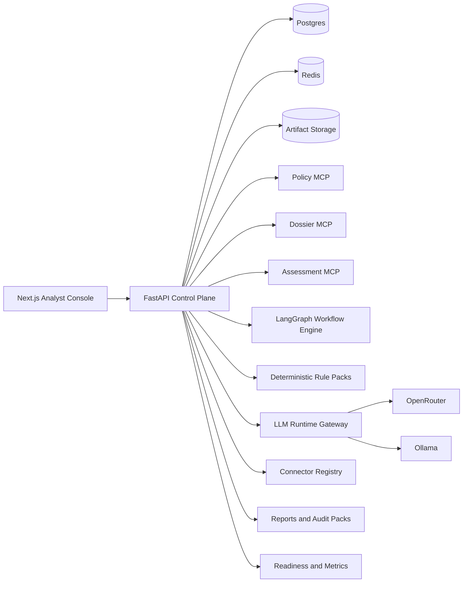

# EU-Comply

EU-Comply is a production-grade AI governance and EU AI Act assessment platform.
It helps teams inventory AI systems, ingest evidence, classify regulatory posture
with deterministic policy logic, route cases through human review, export audit
packs, and re-open assessments when systems or regulations change.

## Layman Introduction

If a company wants to launch or keep using an AI system in Europe, it needs to
know more than just “is this risky?” It needs to know:

- whether the system is even in scope of the EU AI Act
- whether any use is prohibited
- whether the system looks high-risk
- what obligations apply to the provider or deployer
- what evidence supports that answer
- who reviewed the result
- how to prove what was decided later

EU-Comply is built for that real workflow.

Instead of acting like a chatbot that reads the law and guesses, the platform
collects structured case information, parses uploaded evidence, runs a
deterministic rule engine, records human review decisions, and preserves the
result as an exportable audit trail.

## What The Product Does

EU-Comply currently supports:

- case and dossier registration for enterprise AI systems
- artifact upload, parsing, chunking, and extracted-fact persistence
- conflict-aware deterministic assessments
- LangGraph-governed workflow runs with review gates
- approval ledger and review decision capture
- JSON, Markdown, and ZIP audit-pack exports
- first-party MCP servers for policy, dossier, assessment, reassessment, and audit-pack access
- connector registry plus auditable sync runs
- reassessment triggers that can optionally auto-run governed workflows
- OpenRouter and Ollama runtime control
- benchmark and runtime monitoring foundations

## Architecture



### Core Design Rules

- Legal decisioning is deterministic and traceable.
- LLMs assist extraction and explanation, but they do not become the legal source of truth.
- MCP is first-class for interoperability.
- OpenRouter and Ollama are both first-class runtimes.
- Human approval remains separate from machine-generated assessment output.

## Current Functional Surface

### Assessment Flow

1. A reviewer creates a case and fills in the AI system dossier.
2. Evidence files are uploaded and processed into chunks and extracted facts.
3. The deterministic engine evaluates the case against AI Act rule packs.
4. LangGraph routes sensitive or conflicted outcomes into review-required states.
5. Reviewers record approval or changes.
6. The platform exports reports and audit bundles.
7. Connectors or manual actions can trigger reassessment later.

### Outcome Types

- `out_of_scope`
- `prohibited`
- `high_risk`
- `transparency_only`
- `gpai_related`
- `minimal_risk`
- `needs_more_information`

## MCP Surfaces

The application mounts three first-party MCP servers:

- `policy-corpus-mcp`
- `system-dossier-mcp`
- `assessment-mcp`

These surfaces expose policy snapshots, normalized legal fragments, case
workspace context, assessment actions, reassessment triggers, and audit-pack
exports over streamable HTTP.

## Verification Snapshot

Verified at the current repo state:

- `uv run --directory apps/api ruff check .`
- `uv run --directory apps/api pytest` -> `36 passed`
- `uv run --directory apps/api python -m eu_comply_api.tools.run_benchmarks` -> `accuracy: 1.0`
- `uv run --directory apps/api alembic upgrade head` against a clean SQLite verification database
- `uv run --directory apps/api python -m eu_comply_api.tools.seed_policy` against the verification database
- `npm --prefix apps/web run lint`
- `npm --prefix apps/web run build`

## Repository Layout

```text
apps/
  api/        FastAPI control plane, services, MCP, migrations, tests
  web/        Next.js analyst console
packages/
  evaluation/ golden benchmark fixtures
fixtures/
  policies/   seeded policy snapshot data
  rule_packs/ deterministic AI Act rules
ops/
  docker/     compose stacks
  scripts/    validation, backup, restore helpers
docs/
  PROGRESS.md
  HANDOFF.md
  DECISIONS.md
  architecture.md
  verification.md
```

## Local Development

### Prerequisites

- Python 3.13+
- Node 22+
- `uv`
- Docker Desktop

### Start Infrastructure

```powershell
docker compose up -d
```

### Run The API

```powershell
uv sync --directory apps/api --extra dev
uv run --directory apps/api alembic upgrade head
uv run --directory apps/api python -m eu_comply_api.tools.seed_policy
uv run --directory apps/api uvicorn eu_comply_api.main:app --reload --app-dir src
```

### Run The Web Console

```powershell
npm --prefix apps/web install
npm --prefix apps/web run dev
```

The analyst console defaults to `http://127.0.0.1:8000/api/v1`.

## Containerized Deployment

### Build And Run The Full Stack

```powershell
docker compose -f ops/docker/compose.full.yml up --build
```

This stack includes:

- Postgres
- Redis
- MinIO
- FastAPI control plane
- Next.js analyst console

### Environment Templates

- API template: [apps/api/.env.example](/D:/Mehul-Projects/AI%20Act%20Risk%20Classifier%20Agent%20with%20MCP%20+%20LangGraph/apps/api/.env.example)
- Web template: [apps/web/.env.example](/D:/Mehul-Projects/AI%20Act%20Risk%20Classifier%20Agent%20with%20MCP%20+%20LangGraph/apps/web/.env.example)

### Backup And Restore

- Backup script: [ops/scripts/backup.ps1](/D:/Mehul-Projects/AI%20Act%20Risk%20Classifier%20Agent%20with%20MCP%20+%20LangGraph/ops/scripts/backup.ps1)
- Restore script: [ops/scripts/restore.ps1](/D:/Mehul-Projects/AI%20Act%20Risk%20Classifier%20Agent%20with%20MCP%20+%20LangGraph/ops/scripts/restore.ps1)

Additional deployment notes live in
[docs/deployment.md](/D:/Mehul-Projects/AI%20Act%20Risk%20Classifier%20Agent%20with%20MCP%20+%20LangGraph/docs/deployment.md).

## Monitoring And Quality

- Readiness checks verify database connectivity, bootstrap organization presence, policy snapshot availability, and artifact storage writability.
- `/api/v1/metrics` exposes authenticated org-scoped Prometheus-style metrics.
- Golden benchmark scenarios live in
  [packages/evaluation/golden_cases.json](/D:/Mehul-Projects/AI%20Act%20Risk%20Classifier%20Agent%20with%20MCP%20+%20LangGraph/packages/evaluation/golden_cases.json).

## Important Notes

- EU-Comply is decision-support software, not legal advice.
- Review approval remains a human responsibility.
- The rule packs and policy corpus are intentionally versioned so exported decisions remain traceable over time.

## References

- EU AI Act FAQ: https://digital-strategy.ec.europa.eu/en/faqs/navigating-ai-act
- EU AI Act framework: https://digital-strategy.ec.europa.eu/en/policies/regulatory-framework-ai
- EUR-Lex AI Act text: https://eur-lex.europa.eu/legal-content/EN/TXT/?uri=CELEX%3A32024R1689
- Model Context Protocol: https://modelcontextprotocol.io/docs/learn/architecture
- LangGraph docs: https://docs.langchain.com/oss/python/langgraph/overview
